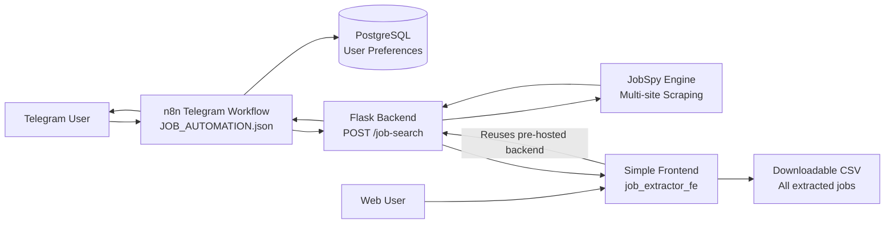
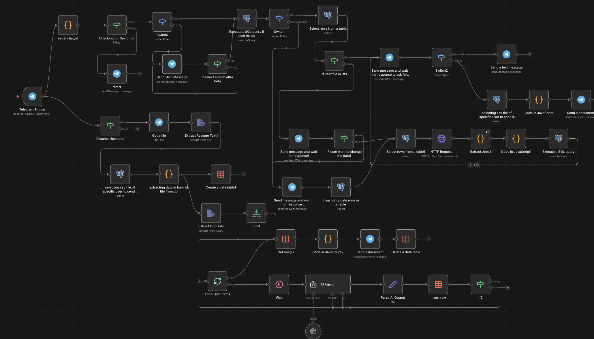

# ApplyFlow


A powerful automation tool that helps you find jobs across multiple platforms (LinkedIn, Indeed, Glassdoor, Google, etc.) directly from Telegram. This project combines a **Python Flask backend** for scraping with an **n8n workflow** for user interaction and orchestration.

## 🚀 Features

-   **Multi-Platform Scraping**: Scrapes jobs from LinkedIn, Indeed, Glassdoor, Google, ZipRecruiter, Naukri, Internshala, and more.
-   **Smart User Management**: Remembers user preferences (Role, Location, Job Type) using a PostgreSQL database.
-   **Smart AI Matching**: Uses AI to analyze your resume's skills and experience against scraped listings to surface the most relevant opportunities.
-   **Interactive Telegram Bot**: specific workflows for new vs. existing users.
-   **AI-Powered CV Tailoring**: Generates a custom-tailored CV for each of your top job matches, all within Telegram.
-   **CSV Export**: Delivers a formatted CSV file with all job listings directly to your Telegram chat.
-   **Custom Filters**: Supports filtering by remote status, job type (Full-time, Intern, etc.), and posting date.


## 📋 Supported Job Sites

| Site | Region | Best For |
|------|--------|----------|
| **Indeed** | Global | High volume, fast scraping |
| **LinkedIn** | Global | Professional roles (rate limited) |
| **Glassdoor** | Global | Jobs + company insights |
| **Google Jobs** | Global | Aggregated listings |
| **Naukri** | 🇮🇳 India | IT & Tech jobs |
| **Internshala** | 🇮🇳 India | Internships & Freshers |
| **ZipRecruiter** | 🇺🇸 USA | US-based roles |
| **Bayt** | 🌍 MENA | Middle East jobs |

## 🛠️ Tech Stack

- **Python (Flask)**: Core API server for scraping logic.
- **JobSpy**: Powerful job scraping library (integrated as local module).
- **n8n (Self-Hosted)**: Workflow orchestration tool.
- **Ngrok**: For secure local tunneling (optional).

## 🔧 How JobSpy Integration Works

This project uses **[JobSpy](https://github.com/Bunsly/JobSpy)** - a Python library for scraping job postings from multiple job boards.

### Integration Approach

Instead of installing JobSpy as a pip package, we integrate it **directly as a local module** (`JobSpy-main_new/`):

```python
# In server.py
sys.path.insert(0, os.path.join(os.path.dirname(__file__), 'JobSpy-main_new'))
from jobspy import scrape_jobs
```

**Why this approach?**
- ✅ **Full Control**: Customize JobSpy's behavior if needed
- ✅ **Version Lock**: No breaking changes from package updates
- ✅ **Offline Deploy**: Works in restricted environments (Railway, Termux)
- ✅ **Dependencies Bundled**: All requirements in one `requirements.txt`


## 🏗️ Architecture



### n8n Workflow



1.  **Orchestration (n8n)**: The `JOB_AUTOMATION.json` file contains the logic for handling Telegram messages, branching logic for user flows, and database interactions.
2.  **Scraping Backend (Python)**: `server.py` runs a Flask app that accepts search parameters, utilizes the `JobSpy` library to scrape jobs, and returns the data as JSON.
3.  **Database (PostgreSQL)**: Stores user preferences and search history for quick access.
4.  **Simple Web Frontend**: The frontend companion app at **[job_extractor_fe](https://github.com/punyajain1/job_extractor_fe)** provides a simple UI to trigger extraction and download a CSV of all jobs.
5.  **Backend Reuse**: The frontend reuses the same pre-hosted backend used by the Telegram-based workflow.


## 🌐 Frontend Companion

Simple browser interface over Telegram:

- **Repo**: https://github.com/punyajain1/job_extractor_fe
- **Purpose**: Simple frontend for fetching extracted jobs from supported sites
- **Output**: Downloadable CSV file containing all extracted job listings
- **Integration**: Reuses the pre-hosted backend from this Telegram version


## 🛠️ Setup & Installation

### Prerequisites

-   Python 3.9+
-   n8n (Self-hosted or Cloud)
-   PostgreSQL Database
-   Telegram Bot Token (via @BotFather)

### Step 1: Backend Setup

1.  Clone the repository and navigate to the folder.
2.  Install dependencies:
    ```bash
    pip install -r requirements.txt
    ```
3.  Start the Flask server:
    ```bash
    python server.py
    ```
    *The server will start on `http://localhost:5000`.*

### Step 2: n8n Workflow Setup

1.  **Import Workflow**:
    -   Open your n8n dashboard.
    -   Click **"Add Workflow"** -> **"Import from..."** -> **"File"**.
    -   Select `JOB_AUTOMATION.json`.

2.  **Configure Credentials**:
    You will need to set up the following credentials in n8n for the nodes to work:
    -   **Telegram API**: Enter your Bot Token from BotFather.
    -   **PostgreSQL**: Enter your database connection details (Host, User, Password, Database).

3.  **Update HTTP Request Node**:
    -   In the n8n workflow, locate the **"HTTP Request"** node (which calls the scraper).
    -   Update the **URL** to point to your backend.
        -   If running locally with n8n (e.g., via tunnel or Docker): `http://host.docker.internal:5000/job-search` or your public tunnel URL (e.g., using ngrok).
        -   The default in the file is a deployed Railway URL: `url`. Change this if you are deploying your own backend.

### Step 3: Database

Ensure your PostgreSQL database is running. The n8n workflow uses a table named `job_search_preferences`. You can create it using the following SQL command:

```sql
CREATE TABLE IF NOT EXISTS job_search_preferences (
    user_id BIGINT PRIMARY KEY,
    search_term TEXT,
    location TEXT,
    google_search_term TEXT,
    default_country TEXT,
    job_type TEXT,
    is_remote BOOLEAN,
    internshala_search_term TEXT,
    hours_old INTEGER,
    updated_at TIMESTAMP
);
```

## 🤖 Usage

1.  Start your Telegram Job Bot.
2.  **New Users**: The bot will ask for:
    -   Search Term (e.g., "Software Engineer")
    -   Location (e.g., "New York")
    -   Google Search Term (optional, for specific Google Job queries)
    -   Job Type & Remote Preferences
3.  **Existing Users**: The bot will recall your last settings and ask if you want to **"Run Search"** immediately or **"Update Settings"**.
4.  **Results & Tailoring**: You will be presented with two options:
    -   **Get Complete Job File**: Receive a raw `.csv` file with all found job openings.
    -   **Personalized Matches**: Upload your current Resume/CV. The bot will analyze your resume against the scraped jobs, find the best matches, and generate a **custom-tailored CV** for each specific role to maximize your chances.


### API Parameters (POST /job-search)

| Parameter | Type | Default | Description |
|-----------|------|---------|-------------|
| `SEARCH_TERM` | string | required | Main search keywords |
| `LOCATION` | string | required | City, country, or "Remote" |
| `HOURS_OLD` | int | 72 | Max age of job postings in hours |
| `JOB_TYPE` | string | null | `fulltime`, `internship`, `parttime`, `contract` |
| `IS_REMOTE` | boolean| false | Set true to filter remote only |
| `DEFAULT_COUNTRY` | string | India | Country for Indeed/Glassdoor |
| `GOOGLE_SEARCH_TERM`| string | null | Specific phrase for Google Jobs |
| `INTERNSHALA_SEARCH_TERM` | string | null | Slug for Internshala (e.g. `software-development`) |

---


## 📜 Credits & License

**Built with ❤️ by [Punya Jain](https://github.com/punyajain1)**

Special thanks to **[JobSpy](https://github.com/Bunsly/JobSpy)** for providing the amazing job scraping library that powers this automation.

---

## 🤝 Contributing

Feel free to submit issues and pull requests!
